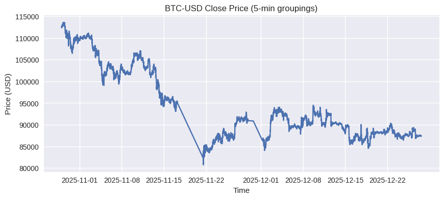
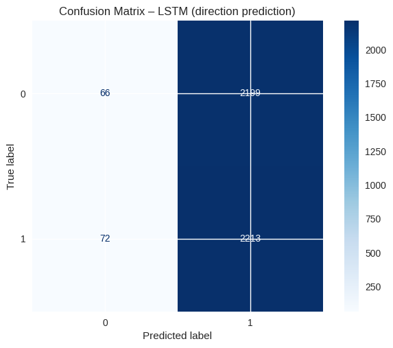
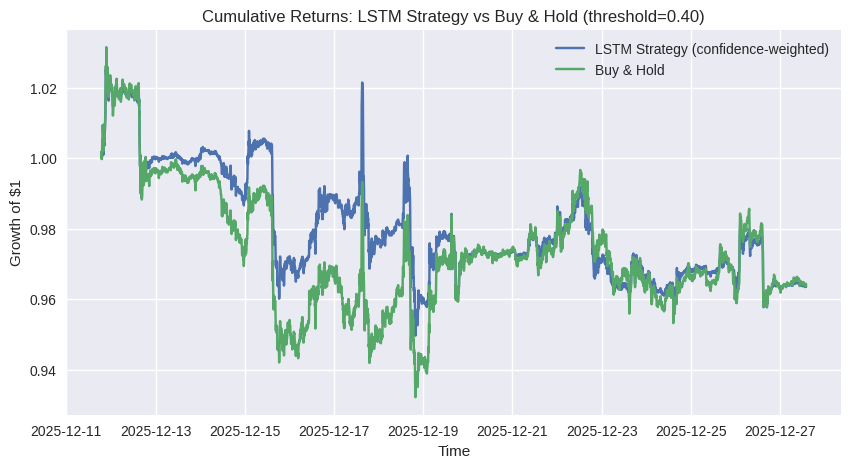

# bitcoin-digital-twin

[](https://colab.research.google.com/github/Price-Jack/bitcoin-digital-twin/blob/main/notebooks/bitcoin_digital_twin.ipynb)

A lightweight “digital twin” of Bitcoin price movement using real-time-style market data, feature engineering, ML baselines, and an LSTM direction model with a simple confidence-weighted strategy comparison.

> **Disclaimer:** Educational project only — not financial advice.

---

## What this project does
- Pulls **BTC-USD** data via `yfinance` using **5-minute bars** over the last **60 days**
- Builds features from price + volume (returns + common technical indicators)
- Trains baseline models:
  - **Linear Regression** for return forecasting
  - **Logistic Regression** for direction classification
- Trains an **LSTM** direction classifier on sequences
  - **Lookback:** 60 steps (~5 hours of history at 5m bars)
  - **Horizon:** 3 steps (~15 minutes ahead)
- Tunes a probability threshold to optimize **F1**
- Compares a **confidence-weighted strategy** vs **Buy & Hold** and runs a basic t-test on returns

---

## Visuals (latest run)
### BTC price (5-min)


### LSTM direction confusion matrix


### Strategy vs Buy & Hold (threshold = 0.40)


---

## Results summary (latest run)

### Regression (predict future return)
- **MAE:** 0.001375  
- **RMSE:** 0.002296  
- **R²:** -0.0093  

### Logistic Regression (direction)
- **Accuracy:** 0.5342  
- **Precision:** 0.5275  
- **Recall:** 0.7084  
- **F1:** 0.6048  

### LSTM (direction)
- **Best threshold for F1:** **0.40** (**F1 = 0.6609**)  
- **Accuracy:** 0.5009  
- **Precision:** 0.5016  
- **Recall:** 0.9685  
- **F1:** 0.6609  

### Strategy settings + comparison
- **Weak buy threshold:** 0.40  
- **Strong buy threshold:** 0.50  
- **Strategy avg return:** -0.000008, **volatility:** 0.001105  
- **Baseline avg return:** -0.000007, **volatility:** 0.001285  
- **t-statistic:** -0.0111  
- **p-value:** 0.991165  

**Interpretation (quick):** The LSTM is strongly biased toward predicting “up” (high recall), which can be useful in momentum/recovery regimes, but this run did not show a statistically significant return advantage vs baseline.

---

## Data Splits & Leakage Prevention (Time-Series)

This is a **time-series** problem, so all evaluation uses **chronological** splits (no random shuffling). Train/validation/test are separated by time to avoid peeking into the future.

Leakage prevention measures:
- **No future data** is used when building features for a given timestep (features are computed from information available at or before that timestamp).
- Model inputs are created as rolling windows using a lookback of **60** steps (~5 hours) to predict direction **3** steps ahead (~15 minutes).
- Any tuning decisions (e.g., probability thresholds) should be chosen on the **validation** window and then reported on the **test** window.

> Note: If you modify the split strategy (e.g., rolling/walk-forward evaluation), document the exact dates/intervals used for each split.

---

## Reproducibility Notes

This project is intended to be reproducible, but results can vary due to:
- market regime changes (non-stationary data),
- stochastic training (random initialization, batching),
- library/hardware differences.

To improve repeatability:
- Set random seeds (NumPy + TensorFlow) when training.
- Use fixed dependency versions (see `requirements.txt`) and note your Python version.
- Run the notebook end-to-end without reordering cells.


## How to run

### Option A: Run in Colab (recommended)
Click **Open in Colab** at the top and run all cells.

### Option B: Run locally
```bash
git clone https://github.com/Price-Jack/bitcoin-digital-twin.git
cd bitcoin-digital-twin
pip install -r requirements.txt
jupyter notebook
